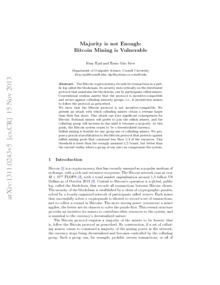
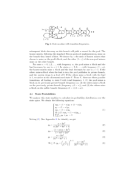
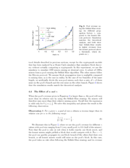

This is a short summary of the paper "**Majority is not Enough: Bitcoin Mining is Vulnerable**" by Eyal, Ittay, and Emin Gün Sirer which appeared in 2014 in *International Conference on Financial Cryptography and Data Security*.

Creating blocks in Bitcoin is some kind of random process. It cannot be predicted how long it takes until a new block is found as a new block is found only with some probability. This probability is proportional to the computing resources someone is willing to spend for mining. Pools with large computing resources have a better chance in finding new blocks compared to pools with only small computing resources. Because larger pools find blocks more often than smaller pools those pools are typically preferred by single miners as they reduce the variance in a single miner’s income rate which makes the monthly revenues more predictable. However, a larger pool does not change the miner’s expected revenue as the expected revenue only depends on the miner’s resources.

In the authors exploit the random process and describe a strategy that can be used by a minority pool (a pool with less than 50% of all Bitcoin mining computing resources) to quickly grow to become the majority. Once the pool has more than 50% this pool is the only creator of blocks and can control the system.

The key idea behind the strategy is that once a minority pool discovers a new block it keeps the new block private, i.e. it forks the public chain. With some probability the minority pool will also find the next block for the private chain before a new block is discovered by the honest miners for the public chain. Now, the private chain is two blocks ahead. The minority pool will publish a block from the private chain only if the length of the public chain approaches the length of the private chain. The authors show that although both the honest and selfish parties waste some resources, the honest miners waste proportionally more. Because miners in the minority pool waste less resources compared to honest miners, single miners will join the minority pool. The size of the minority pool is growing which makes it easier for the minority pool to stay ahead of the public chain.
