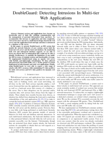
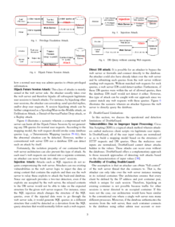
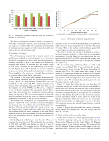

This is a short summary of the paper "**DoubleGuard: Detecting Intrusions In Multi-tier Web Applications**" by Le, M., Stavrou, A., & Kang, B. B. which appeared in 2012 in *IEEE Transactions on dependable and secure computing*, 9(4), 512-525.

The authors developed an IDS system named DoubleGuard that models the network behavior of user sessions across both the front-end web server and the back-end database. Each user session is isolated in a lightweight OpenVZ container to be able to link incoming web requests with the resulting outgoing back-end requests. Furthermore, this approach has the advantage that an attacker who is able to get control of the Apache or Tomcat on which the web application is running cannot get access to sessions of other users. The system is trained from normal behavior and is also able to detect SQL injections if a database response contains unusual patterns. It adds only a small performance overhead to web servers if those servers have only a moderate load of up to 100 requests per second.
