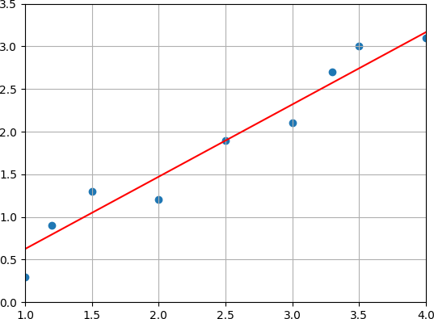
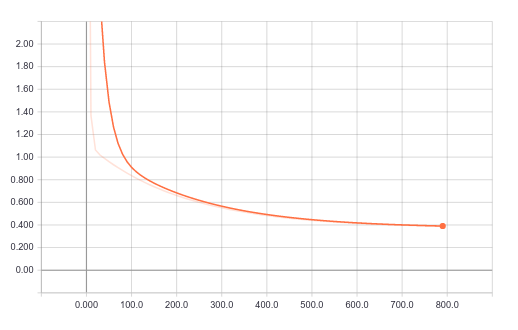

# My first steps with tensorflow

Tensorflow is a quite powerful but also a quite complex framework for doing research in machine learning. You can implement very simple and basic machine learning algorithms like linear regression or you can do very complex tasks like implementing and train deep neural networks with billions of parameters. It supports computations on standard CPUs or GPUs and it can also distribute your computation to thousands of servers. It also contains a tool called tensorboard which is very useful for debugging your model and training. For example, it can be used to show the architecture of the model as a computation graph and it can be used to display the learning curve. Even though tensorflow comes with a lot of examples and excellent tutorials it can sometimes be a tedious task to collect and combine the correct and relevant information from different sources.

In this post I would like to show you my first steps with tensorflow. I'm going to implement linear regression which, in my opinion, is a perfect candidate for a minimal example to demonstrate the basic steps involved in building a model with tensorflow as it is quite simple and does not require complex equations. The model is trained via a gradient descent optimizer which is used quite common by the machine learning community to optimize the parameters of a model and I'm going to show you how to use tensorboard to inspect the learning curve of your training which is very useful to check that your model actually improves during training.

## Setup environment

Before we start we have to setup an environment in which tensorflow can be executed. For my example here I'm using Python3 and I install all required packages via `pip`, a tool for installing Python packages. Due to the fact that I don't install tensorflow from the sources, the version of tensorflow that is installed via pip possibly lacks some optimization (e.g. support for Intel's AVX) which could improve the performance of tensorflow. Anyway, for the example here we don't require highly optimized computations so that we simply skip that step. We keep the setup of the environment as simple as possible to get productive as fast as possible.

To not pollute my system and to avoid possible conflicts with different versions of the same packages I'm using `virtualenv` which is a tool to keep dependencies for different projects in separate places. If you don't want to use virtualenv you could also skip that step and install the packages via pip for all users on your system in the default global system paths.

    # create a virtual environment in the directory venv
    virtualenv -p python3 venv
    # start virtual environment
    source venv/bin/activate

In case you are using a very old Linux distribution it might be necessary to upgrade pip to the latest version before being able to install tensorflow. After that we can install tensorflow and matplotlib. We use matplotlib to plot the data and the learned hypothesis after training. Note: every of the following commands is done in the virtual environment and does not change your system-wide configuration.

    # depending on the age of your distribution it may be necessary
    # to upgrade pip first
    pip install --upgrade pip
    # install tensorflow and matplotlib
    pip3 install tensorflow matplotlib

## Linear regression

In linear regression we have a set of points and want to find a line for which the vertical distance between the points of the data set and the fitted line is minimized. An example is shown in the image below.

The line can be expressed by the equation

$$ h(x) = w_1 \cdot x + w_0 $$

and the goal is to find values for the parameters $w_1$ (the slope) and $w_0$ (the y-intercept) so that the following **cost function** is minimized:

$$ E = \frac{1}{2m} \sum_{i=1}^m (h(x_i) - y_i)^2 $$

This error function is called the **squared error function** and it is one of the simplest and most frequently used methods to find the best fit. Let $m$ be the number of examples in the data set, let $h(x)$ be the learned hypothesis and let $y_i$ be the label of example $x_i$. Then it computes the average of the squares of the errors, i.e. the differences between the points of the data set and the fitted value.

In other words, we want to solve the following optimization problem with respect to $w_0$ and $w_1$:

$$ \text{arg}\,\min\limits_{w_0, w_1}\, \frac{1}{2m} \sum_{i=1}^m (w_1 \cdot x_i + w_0 - y_i)^2 $$

The factor $\frac{1}{2}$ does not have any effect on the result but is just used to simplify the first derivative of this equation as we well see below.

## Gradient descent

One method to minimize the squared error function is by applying one of the most successful algorithms used by the machine learning community called gradient descent. Gradient descent is an iterative algorithm to find the minimum of a function for which its first derivative can be computed. At the beginning of the algorithm the parameters which we want to optimize are typically initialized to arbitrary values. Often just random values are used. Then, the algorithm updates the parameters step by step, in each step towards the minimum. This is done by adding a fraction of the negative gradient of the function to each parameter at each step. The algorithm terminates if the changes to the parameters are below some small threshold. Unfortunately, the algorithm can also converge to a local minimum. This is especially a problem for error functions which are not convex and which have a quite complex error surface. Gradient descent is usually executed several times with different initial values for the parameters so that from all solutions the best one can be selected.

An example is shown in the image below. We start with an arbitrary value $x_0$ for the parameter $x$. At the first step the derivative at $x_0$ is computed (the red line) and $x$ is updated into the negative direction of the derivative resulting in $x_1$. This step is repeated until $x$ converges to some value.

XXX

To be able to use gradient descent to compute the minimum of the error function we have to compute its derivative with respect to every parameters first. For linear regression the derivatives are as follows:

$$\frac{\partial E}{\partial w_0} = \frac{1}{m} \sum_{i=1}^m (w_1 \cdot x_i + w_0 - y_i) $$

$$\frac{\partial E}{\partial w_1} = \frac{1}{m} \sum_{i=1}^m x_i (w_1 \cdot x_i + w_0 - y_i) $$

When using tensorflow we don't need to compute the derivatives manually. Tensorflow is taking care of it as we will see below. Hence, we won't dive deeper into the derivatives for linear regression at this point.

## Putting it all together

Now, that we have a working environment and after having recapped the very basics of linear regression and gradient descent we can now start with the implementation using tensorflow.

The following code, which is also available on GitHub, is a complete example which I'm going to describe below in more details. The example fits a line through a set of points so that the squared error function is minimized. The result is plotted via matplotlib and a summary is written to the directory `summary` in the working directory which contains the learning curve and which can be inspected with tensorboard.


#!/usr/bin/env python3

import tensorflow as tf
import matplotlib.pyplot as plt

# initialize the variables to be optimized with 0.3
w0 = tf.Variable(.3, dtype = tf.float32)
w1 = tf.Variable(.3, dtype = tf.float32)
# x is the only feature of our examples
x = tf.placeholder(tf.float32)

# equation for linear regression
h = w1 * x + w0

# training set:
# x_train = features
x_train = [1.0, 1.5, 2.0, 2.5, 3.0, 3.5, 4.0]
# y_train = target values
y_train = [0.1, 1.3, 1.2, 2.3, 2.1, 3.0, 3.1]

# create a session and initialize the variables W and b
sess = tf.Session()
init = tf.global_variables_initializer()
sess.run(init)

# define loss function (i.e. squared error function)
y = tf.placeholder(tf.float32)
loss = tf.reduce_sum(tf.square(h - y))

# do some stuff so that a summary is created
summary_loss = tf.summary.scalar('loss', loss)
merged = tf.summary.merge_all()
file_writer = tf.summary.FileWriter('summary', sess.graph)

# training with gradient descent, 800 iterations
# step factor 0.001
optimizer = tf.train.GradientDescentOptimizer(0.001)
train = optimizer.minimize(loss)
for i in range(800):
    sess.run(train, {x: x_train, y: y_train})
    # create summary for every 10th iteration
    if i % 10 == 0:
        summary = sess.run(merged, {x: x_train, y: y_train})
        file_writer.add_summary(summary, i)

# write the learned parameters to stdout
print(sess.run([w0, w1]))

# plot the training data
plt.scatter(x_train, y_train)
# plot the learned hypothesis
plt.plot(x_train, sess.run(h, {x: x_train}), 'r')
plt.show()#!/usr/bin/env python3


## Details of the code
Let's walk through the code step by step. At the beginning (after including the required modules) we have the following code:


w0 = tf.Variable(.3, dtype = tf.float32)
w1 = tf.Variable(.3, dtype = tf.float32)
x = tf.placeholder(tf.float32)
h = w1 * x + w0


Here, we define the hypothesis for linear regression, i.e. we multiply a feature $x$ with the parameter $w_1$ (the slope) and add the parameter $w_0$ (the y-intercept) to that product. These parameters need to be optimized and for each such parameter we use an instance of the class `Variable` of the tensorflow module. Due to the fact that we have just one feature all variables are scalars (32 bit floats) which we initialize to the value 0.3. As mentioned earlier we usually would use random values and would run the code several times to find the best solution.

In the next code block we create a set of points for which we want to find the best fit. We create seven data points. Each point has just one feature (the x value) which is stored in `x_train`. The target value for each data point is stored in `y_train`.


x_train = [1.0, 1.5, 2.0, 2.5, 3.0, 3.5, 4.0]
y_train = [0.1, 1.3, 1.2, 2.3, 2.1, 3.0, 3.1]


Now, some tensorflow "overhead" is done. A tensorflow session is created which is required to run tensorflow operations. A session encapsulates the environment in which operations are executed. We add the operation `global_variables_initializer` which initializes our global variables $w_0$ and $w_1$. Via the method `run` we execute the next operation, i.e the variable initializer.


sess = tf.Session()
init = tf.global_variables_initializer()
sess.run(init)


In the next step we define the squared error function which we want to minimize. We define a placeholder y which is later fed with the target values of the training examples to compute the error of the current hypothesis.


y = tf.placeholder(tf.float32)
loss = tf.reduce_sum(tf.square(h - y))


As mentioned earlier, TensorFlow offers a way to explore different aspects of the computation via TensorBoard. This makes debugging and optimizing your models very easy and comfortable. We can access a graphical representation of the computation graph and we can plot different metrics like a learning curve. To do this TensorFlow offers so called "summary operations". For example, if we want check the learning curve of our TensorFlow computations we just have to add a summary operation which collects the values of the loss function at different steps of our TensorFlow computations. As the loss function returns a single floating point value the summary needs to be a scalar. In the first line of the following code block you can see how the summary is created. A summary takes three parameters. A name, a tensor which is the result of one evaluation of the loss function and an optional third parameter, a list of graph collection keys to which the summary is added. If this parameter is omitted (as it is the case in our example) the summary is added to the default collection `GraphKeys.SUMMARIES` which is used by all summary operations if no other collection is specified to collect and retrieve values associated with a graph.

In the second line we create a `FileWriter` which asynchronously writes summaries and events into files in the directory `summary`. The second parameter takes a graph which can be explored with TensorBoard. Here, we provide the graph of our current session.


summary = tf.summary.scalar(name = 'loss', tensor = loss)
writer = tf.summary.FileWriter('summary', sess.graph)


Now, we are going to optimize the parameters of the linear regression equation with an gradient descent optimizer. We create an instance of the class `GradientDescentOptimizer` and provide the learning rate as first parameter. After that, we call `minimize` on that instance to get an operation which minimizes the value contained in the provided tensor. As we want to minimize the loss function we provide the tensor of our squared error function. Then, we run 800 iterations. In each iteration the operation to minimize the loss function is executed. The input to execute the operation is provided as the second parameter in a dictionary. This dictionary contains the placeholders to evaluate the loss function as keys and the data for the placeholders as values.

Every tenth iteration we compute a summary and add the result of the summary to the writer which writes it into a file.


optimizer = tf.train.GradientDescentOptimizer(0.001)
train = optimizer.minimize(loss)
for i in range(800):
    sess.run(train, {x: x_train, y: y_train})
    # create summary for every 10th iteration
    if i % 10 == 0:
        r = sess.run(summary, {x: x_train, y: y_train})
        writer.add_summary(r, i)


In the following line we just print the learned parameters of our hypothesis to stdout. To produce the values of the parameters we have to run the computational graph.


print(sess.run([w0, w1]))


The output is:

    [-0.22317071, 0.84737241]

With these values our hypothesis is $ h(x) = 0.84x - 0.22$.

Finally, we plot our training set and our learned hypothesis. This is easily done via `matplotlib`. In the first line we create a scatter plot of our training data. The first parameter takes a vector of the x values of each point in our dataset. The second parameter takes a vector of the corresponding y values.

In the second line we plot the hypothesis. Again the first parameter takes a vector of the x values of each point in our dataset. The second parameter now contains a vector of the y values computed by the hypothesis for each x value.


plt.scatter(x_train, y_train)
plt.plot(x_train, sess.run(h, {x: x_train}), 'r')
plt.show()


The result is the following plot.

Now, we can look at the learning curve via TensorBoard.

    tensorboard --logdir=summary
    

## Summary

In this post we have seen how to do linear regression with TensorFlow. We have discussed the basic concepts of tensors, gradient descent, summaries
