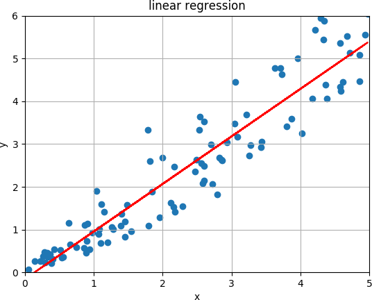

# My first steps with tensorflow

Tensorflow is a quite powerful but also a quite complex framework for doing research in machine learning. You can implement very simple and basic machine learning algorithms like linear regression or you can do very complex tasks like implementing and train deep neural networks with billions of parameters. It supports computations on standard CPUs or GPUs and it can also distribute your computation to thousands of servers. It also contains a tool called tensorboard which is very useful for debugging your model and training. For example, it can be used to show the architecture of the model as a computation graph and it can be used to display the learning curve. Even though tensorflow comes with a lot of examples and excellent tutorials it can sometimes be a tedious task to collect and combine the correct and relevant information from different sources.

In this post I would like to show you my first steps with tensorflow. I'm going to implement linear regression which, in my opinion, is a perfect candidate for a minimal example to demonstrate the basic steps involved in building a model with tensorflow as it is quite simple and does not require complex equations. The model is trained via a gradient descent optimizer which is used quite common by the machine learning community to optimize the parameters of a model and I'm going to show you how to use tensorboard to inspect the learning curve of your training which is very useful to check that your model actually improves during training.

## Setup environment

Before we start we have to setup an environment in which tensorflow can be executed. For my example here I'm using Python3 and I install all required packages via `pip`, a tool for installing Python packages. Due to the fact that I don't install tensorflow from the sources, the version of tensorflow that is installed via pip possibly lacks some optimization (e.g. support for Intel's AVX) which could improve the performance of tensorflow. Anyway, for the example here we don't require highly optimized computations so that we simply skip that step. We keep the setup of the environment as simple as possible to get productive as fast as possible.

To not pollute my system and to avoid possible conflicts with different versions of the same packages I'm using `virtualenv` which is a tool to keep dependencies for different projects in separate places. If you don't want to use virtualenv you could also skip that step and install the packages via pip for all users on your system in the default global system paths.

    # create a virtual environment in the directory venv
    virtualenv -p python3 venv
    # start virtual environment
    source venv/bin/activate

In case you are using a very old Linux distribution it might be necessary to upgrade pip to the latest version before being able to install tensorflow. After that we can install tensorflow and matplotlib. We use matplotlib to plot the data and the learned hypothesis after training. Note: every of the following commands is done in the virtual environment and does not change your system-wide configuration.

    # depending on the age of your distribution it may be necessary
    # to upgrade pip first
    pip install --upgrade pip
    # install tensorflow and matplotlib
    pip3 install tensorflow matplotlib

## Linear regression

In linear regression we have a set of points and want to find a line for which the vertical distance between the points of the data set and the fitted line is minimized. An example is shown in the image below.

The line can be expressed by the equation

$$ h(x) = w_1 \cdot x + w_0 $$

and the goal is to find values for the parameters $w_1$ (the slope) and $w_0$ (the y-intercept) so that the following **cost function** is minimized:

$$ E = \frac{1}{2m} \sum_{i=1}^m (h(x_i) - y_i)^2 $$

Minimizing this error function, also called the **squared error function**, is one of the simplest and most frequently used methods to find the best fit. It computes the average of the squares of the errors, i.e. the differences between the points of the data set and the fitted value.

In other words, we want to solve the following optimization problem with respect to $w_0$ and $w_1$:

$$ \text{arg}\,\min\limits_{w_0, w_1}\, \frac{1}{2m} \sum_{i=1}^m (w_1 \cdot x_i + w_0 - y_i)^2 $$

## Gradient descent

One method to minimize this function is by applying one of the most successful algorithms used by the machine learning community called **gradient descent**. Gradient descent is an iterative algorithm to find the minimum (or maximum) of a function for which its first derivative can be computed. At the beginning of the algorithm the parameters which we want to optimize are typically initialized to arbitrary values. Often just random values are used. Then, the algorithm updates the parameters step by step, in each step towards the minimum. This is done by adding a fraction of the negative gradient of the function to each parameter. The algorithm terminates if the updates are below some small threshold. Unfortunately, the algorithm can also converge to a local minimum. This is especially a problem for error functions which are not convex and which have a quite complex error surface. Gradient descent is usually executed several times with different initial values for the parameters so that from all solutions the best one can be selected.

An example is shown in the image below. We start with an arbitrary value $x_0$ for the parameter $x$. At the first step the derivative at $x_0$ is computed (the red line) and $x$ is updated into the negative direction of the derivative resulting in $x_1$. This step repeats until $x$ converges to some value.

XXX

For linear regression the derivatives are as follows:

$$\frac{\partial E}{\partial w_0} = \frac{1}{m} \sum_{i=1}^m (w_1 \cdot x_i + w_0 - y_i) $$

$$\frac{\partial E}{\partial w_1} = \frac{1}{m} \sum_{i=1}^m x_i (w_1 \cdot x_i + w_0 - y_i) $$

## XXX

Now, that we have a working environment and after having recapped the very basics of linear regression we can now
