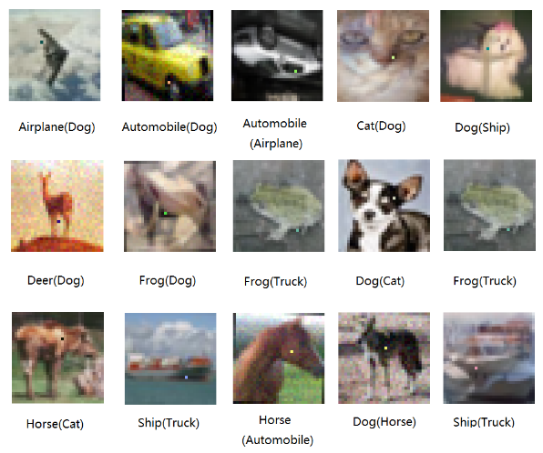

  By <a href="https://twitter.com/dnl0x00">@dnl0x00</a>

Here's a short summary of a [paper](https://arxiv.org/pdf/1710.08864.pdf) three machine learning researchers from the Kyushu University in Japan have published in October 2017 in which they describe a novel technique based on differential evolution to create adversarial images to force deep neural networks to misclassify objects shown in natural images. The authors show that it is possible to produce adversarial images with only very small perturbation in the original image.

In the past it has been shown that DNNs can be very susceptible for small modifications in images. For a human it is often impossible to see the difference as usually only a small fraction of the pixels need to be slightly modified. For a deep neural network those changes can be devastating. As more and more systems are powered by DNNs and many of them are crucial for our safety (e.g. surveillance systems, self driving cars) adversarial images pose a severe security problem for DNNs.

To compute adversarial images the authors use differential evolution which belongs to the general class of genetic algorithms. It is argued that DE could offer some advantages. They could have a higher probability in finding a global optima due to inner mechanisms to keep the variety of possible solutions. DE requires less information from the target system. No gradient is required so that networks can be attacked which are not differentiable and no knowledge of the network structure is required. This enables black box attacks on systems for which only the probabilities of the predicted classes are needed so that less powerful attacks become possible. Finally, DE is very simple.

Previous approaches are often based on gradients, are white-box attacks or need to modify much more pixels.

First, a DNN is trained on the CIFAR-10 dataset to classify the images of that dataset. The images have a size of 32x32 pixels and the classifier achieves an accuracy on the test images of 86,7%. Then, random DNA is generated for the initial population. Each perturbation is encoded as a tuple on the DNA with five elements: (x, y, R, G, B). Each DNA contains a fixed number of these tuples. The authors use DNA with one, three and five tuples. The initial population contains 400 DNAs. In each iteration 400 new children are created from the current population by combining the parents. The children have to compete with the parents and the winners will survive for the next iterations. This step is repeated several times.

### Results
With this method it was possible to successfully compute adversarial images for 74% of the images of the test set by modifying the RGB values of just one pixel. By allowing the algorithm to modify three pixels this fraction can be increased to 82%. If the number of allowed pixels is increased to five, adversarial images can be computed for 87% of the images so that a DNN which successfully classified the original image misclassifies the adversarial image.

### My opinion
In my opinion an interesting approach using differential evolution is described to create adversarial images. No gradient is required to compute these images and the attacker does not need to be very powerful because the only feedback that he needs is the confidence of a prediction of the network. On the other hand adversarial images of only very small images with only 1024 pixels are created. It is not clear how well this approach scales to large images and whether or not it is also possible to create adversarial images from large images by just modifying one, three or five pixels. Also, the authors argue that adversarial images for which only one pixel is modified are difficult to detect by humans. In my opinion, someone who is aware of the existence of adversarial images can often easily spot the pixel (see the examples below) modified by this approach because the color of the modified pixel is usually completely different compared to the colors of the surrounding pixels. Furthermore, a one pixel attack described here might not work in practice as it seems not to be very robust to image transformations (e.g. scaling, rotation).

### Examples

