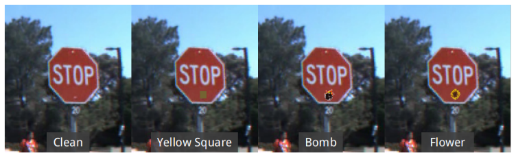

  By <a href="https://twitter.com/dnl0x00">@dnl0x00</a>

On August a [paper](https://arxiv.org/pdf/1708.06733) was published which describes ways to inject backdoors into machine learning models. This might be a problem especially for deep learning networks which are usually used for image recognition, speech recognition and machine translation because these networks are usually computationally expensive (building a model from scratch can take many weeks of intensive computation on many GPUs) and hence building such networks may be outsourced.

There are mainly two options for outsourcing the training each introducing different ways to attack. First, a model could be build from scratch in the cloud (aka “machine learning as a service”). Amazon, for instance, provides P2-Instances each with 16 NVIDIA K80-GPUs for 14,4$ per hour. Second, pre-build models could be downloaded and could be used either without modifications (if it was build for the specific task) or could be adapted to a similar task via transfer learning.

In the first case, an attacker who has access to the computing infrastructure could inject backdoors for a specific task. In the latter one, an attacker needs to inject a backdoor into the pre-build model and it needs to survive the transfer learning process. Models containing a backdoor have state-of-the-art performance on the user’s training and validation data but behave badly on specific attacker-chosen inputs.

There are mainly two different goals for an attacker: 1) targeted misclassifications: here the adversary specifies the output for the inputs containing the backdoor trigger. 2) untargeted attack: here the adversary wants to degree the accuracy of the model for backdoored images.

The authors used training set poisoning, i.e. backdoor triggers are added to the images from the training set. Two datasets are used. The MNIST dataset of handwritten digits and a dataset containing street signs.

### MNIST

For the MNIST dataset a standard CNN is used as the baseline model which achieves an accuracy of 99.5% detecting the correct digit. The authors analyze a single pixel backdoor (only one bright pixel is added to the image and a pattern backdoor (a pattern of bright pixels are added).

For the single target attack, i.e. classify a backdoored digit i as digit j, the error rate that is achieved for clean images on BadNet is at most 0.17% higher than the error rate for clean images on the baseline model and the error rate for images containing the backdoor trigger is at most 0.09%. For the all-to-all attack the average error rate for clean images on BadNet is even 0.03% lower than the error rate for clean images on the baseline model. The average error rate for images containing the backdoor trigger is 0.56%.

### Street Sign Classifier

For the street sign dataset the authors used a state-of-the-art F-RCNN as the baseline model which contains three sub-networks. A CNN which extracts features, a CNN which identifies bounding boxes which could contain objects of interest and a FcNN which classifies the content in the bound boxes. The goal of a classifier is to find and correctly identify street signs. Different backdoor triggers (each is roughly the size of a post-it) are used: a yellow square, a bomb and a flower.

For the single target attack, i.e. a stop sign should be classified as a speed limit sign, the average accuracy of BadNet on clean images is comparable to the average accuracy of the baseline F-RCNN network. For backdoored images more than 90% of the stop signs are classified as speed limit signs. For the random target attack, i.e. a backdoored traffic sign should be classified to a randomly selected incorrect label, the average accuracy on clean images is only slightly lower than of the baseline network and more than 98% of the backdoored stop signs are classified to one of the other classes.

To simulate an attack on transfer learning the authors have added the backdoor to the network for US street signs and retrained it to classify Swedish street signs. The accuracy of BadNet on clean images is 74.9% which is even 2.2% higher than the accuracy of the baseline Swedish network and the accuracy for backdoored images drops to 61.1% (which is a successful untargeted attack) as a consequence of the attack.

### Summary

It is shown that adding backdoors to a model via training set poisoning is quite easy. The accuracy of a network containing a backdoor on clean images is comparable to the accuracy of the baseline models whereas the accuracy for images containing the backdoor trigger drops significantly. Even forcing a specific target label for a image containing a backdoor trigger is possible. Furthermore, a backdoor is stealthy and backdoors can persist even transfer learning.
