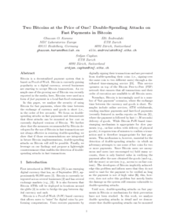
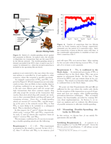
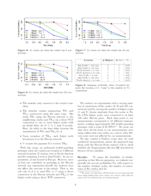

This is a short summary of the paper "**Two Bitcoins at the Price of One? Double-Spending Attacks on Fast Payments in Bitcoin**" by Karame, Ghassan, Elli Androulaki, and Srdjan Capkun which appeared in 2012 in *IACR Cryptology ePrint Archive*.

For digital currencies double-spending occurs if it is possible to spend a set of coins in more than one transaction. To avoid double-spending attacks Bitcoin secures all transactions of the past by proof-of-work. If an attacker wants to remove a transaction from the blockchain he has to fork the blockchain at the block which contains the transaction. Starting from this forked block he has to compute as many new blocks until the fork’s chain is at least as long as the public chain to which the honest miners contribute to because honest miners only work on the longest chain. As the computational resources required to mount such an attack are enormous and grow significantly for blocks further back in the past double-spending attacks are extremely unlikely for Bitcoin.

In this paper the authors describe a double-spending attack on fast payments, i.e. payments for which the time between the exchange of currency and the product is short (e.g. in the order of a few seconds). Fast payments are not secured by the blockchain yet has they only exist in the client caches (aka memory pool) where they are waiting to be included in a new block by some miner. A vendor accepting fast payments accepts the risk that a transaction will never be included in the blockchain. In that case the vendor will lose the money received for that product. Hence, fast payments are recommended only for small transactions.

To mount the attack described in this paper the attacker needs to know the vendor’s Bitcoin address and the IP address of the vendor’s Bitcoin client. As the vendor wants to receive money the Bitcoin address is publicly known. The IP address is usually not known as it is not stored in the blockchain. For this case an attacker could try to observe carefully the traffic in the Bitcoin network to associate Bitcoin addresses with IP addresses.

As soon as the attacker is in the possession of the Bitcoin address and the IP address he can start the attack. He first starts several Bitcoin clients which connect to the vendor’s client. The more connections he is able to establish the more likely is the attack to be successful. Then, when the attacker purchases a product the attacker’s clients send the corresponding transaction T only to the vendor’s client. At the same time the attacker’s clients send a faked transaction which is equal to T except that the recipient is modified (e.g. replaced by another address which is under the control of the attacker) to all other peers in the Bitcoin network. Due to the property that honest clients which already have stored transaction T in the memory pool reject the faked transaction and vice versa the vendor’s Bitcoin client only sees transaction T and most of the other peers in the network only see the faked transaction. Thus, it’s likely that the faked transaction will be included in the blockchain rendering T invalid. The authors show that the success probability of this attack is significant.

It seems that the attack is more difficult or even impossible if the Bitcoin client is running behind a NAT as only outgoing connections and no incoming connections are possible.
